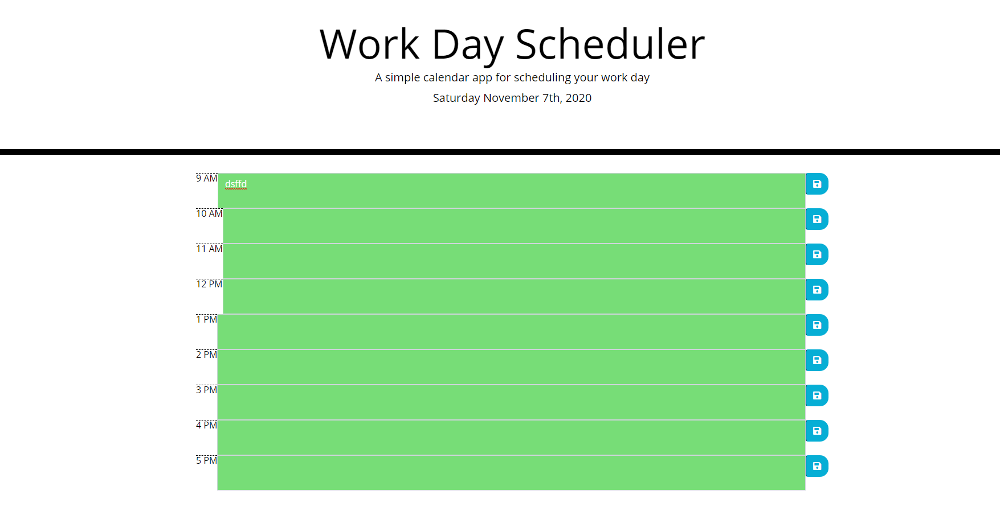

Welcome to my attempt at creating a day planner!

https://chrisnguyeen.github.io/day-planner/

Here you are able to:
  - Input your plans for your day
  - Save your plan/plans
  - Keep track of your plans with the save button
 
This application will help provide structure to a busy person's day.

